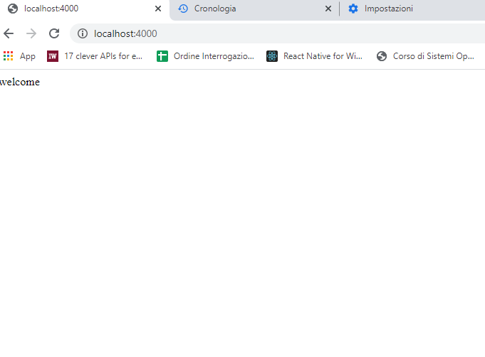

# Esempio Basic Authentication

Schema di interazione client/server, nella *Basic Authentication*: 

Per avviare l'applicazione:

`node server.js`

Da browser accedi alla risorsa: http://localhost:4000

Digitando le credenziali *john* e *secret* come username e passoword, accediamo alla risorsa. (se si sbaglia ad autenticarsi il server risponde sempre con `401 Anauthorized` e il browser ripropone la form di authenticazione).

Guardando la richiesta http del client, si vede che gli è inviato l'header `Authorization: Basic am9objpzZWNyZXQ=` con (il base64 della password).

Anche accedendo alla risorsa http://localhost:4000/second, si vede che il browser manda l'header l'header `Authorization: Basic am9objpzZWNyZXQ=`.

Per fare il *logout* necessario cancellare i dati di navigazione del browser.

## Utility

Codifica in Base64: `npm run encode <username> <password>`

Esempio: `npm run encode pippo pluto`

Decodifica di Base64: `npm run decode <base66string>`

Esempio: `npm run decode cGlwcG86cGx1dG8=`

Per avere l'hash della password in modo da non averle in chiaro, utilizzando bcrypt:

`npm run hash <password>`

Ad esempio: `npm run hash paperino`

